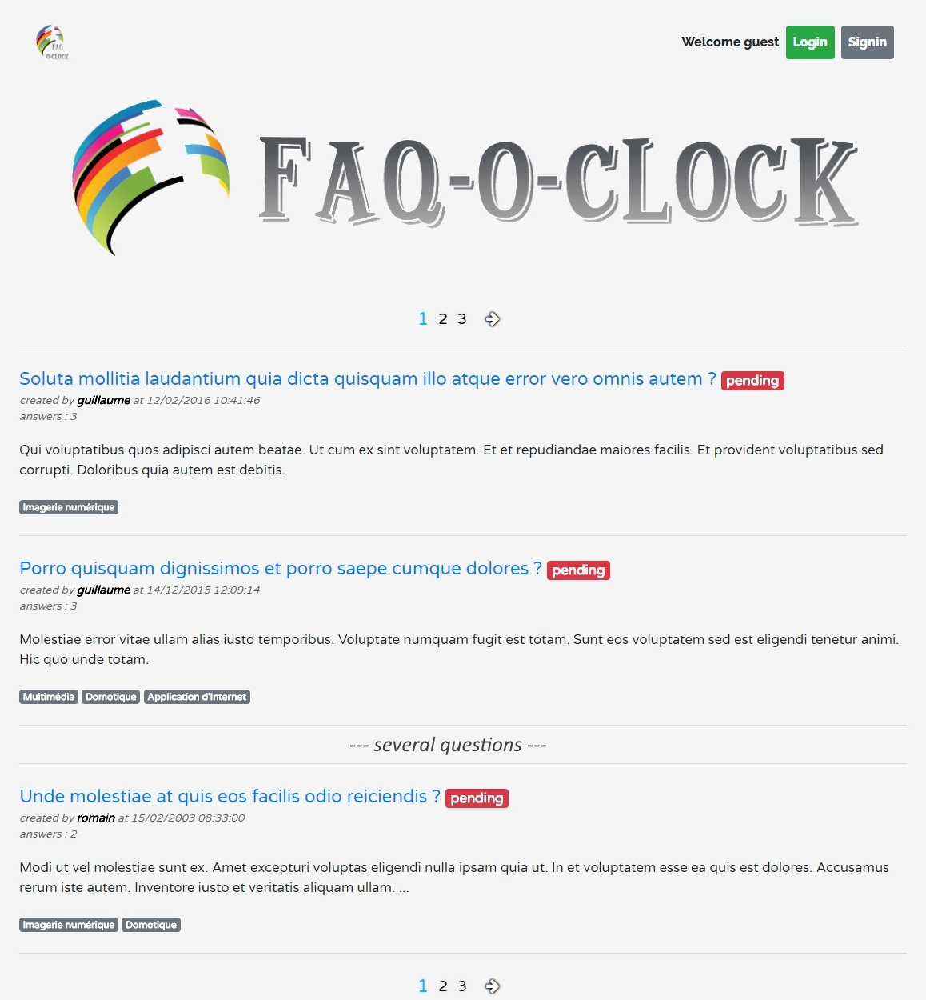

# Portfolio - Faq-O-Clock
[> Page détaillé de l'exercice sur mon site <](neo-explorer.com/portfolio/faqoclock "Page de l'exercice sur mon site")

Ce site web réalisé en une quarantaine d'heures est le résultat de trois semaines d'apprentissage sur le framework Symfony. Basé sur le modèle de Quora/StackOverflow, il s'agissait de coder une application de type questions/réponses.

## Principe
Tous les utilisateurs peuvent consulter le contenu du site, mais ils doivent être inscrit pour pouvoir poser et répondre aux questions des autres utilisateurs. De plus, l'application dispose d'un système de vote "+1" pour les questions et réponses (codé en Ajax) ainsi que la possibilité d'associer aux questions une ou plusieurs catégories, ce qui permet aux utilisateurs de les filtrer d'après ces dernières. Les administrateurs ont quand à eux, accès à un CRUD directement intégré à l'application afin de pouvoir administrer les questions et les réponses, mais également à la liste des utilisateurs, à la liste des rôles (utilisateur simple ou administrateur par exemple) ainsi qu'à la liste des catégories.

