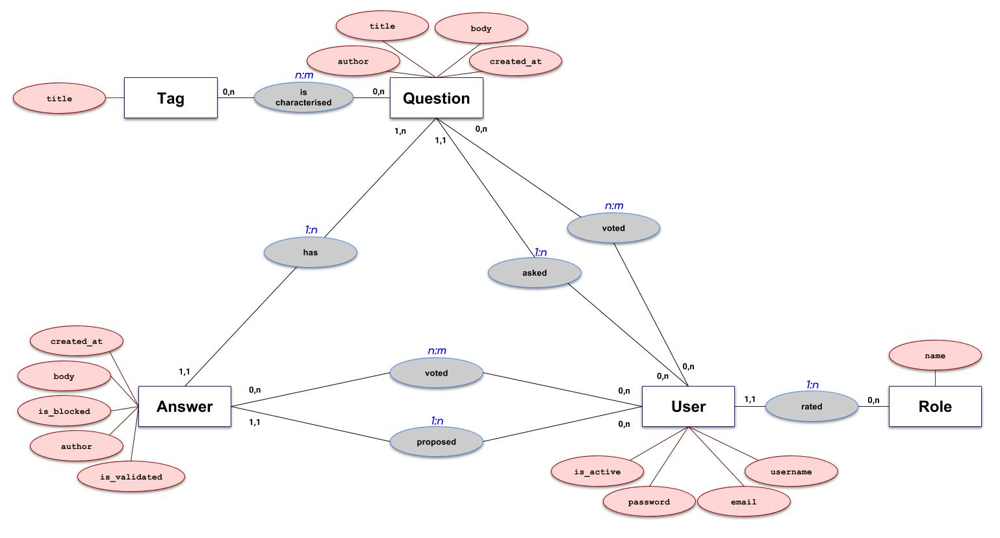
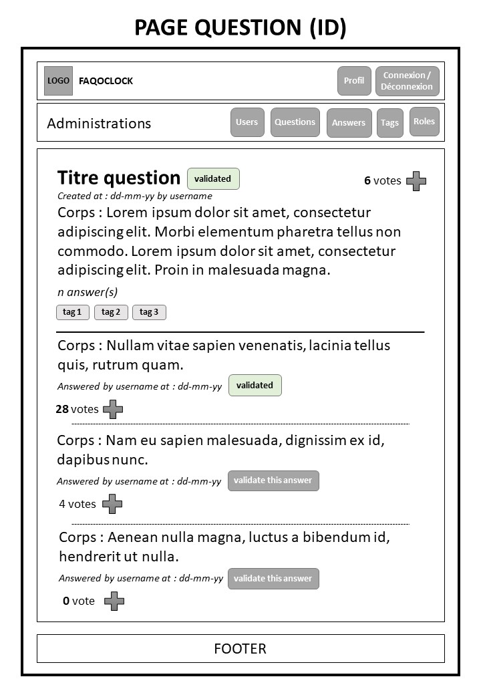
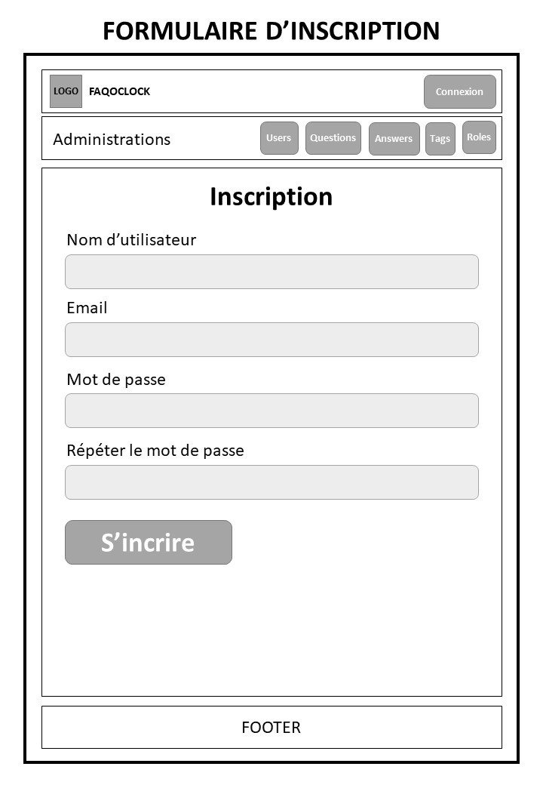
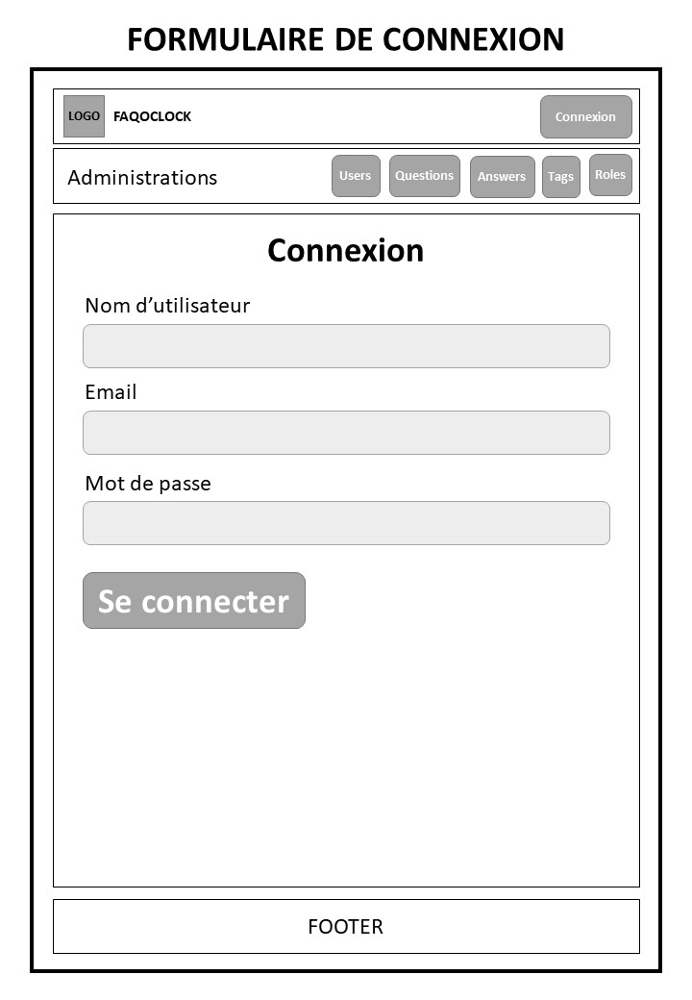
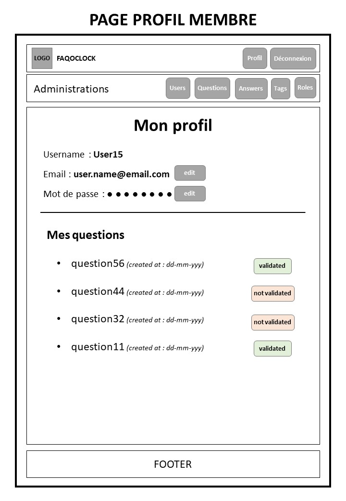

# Liens vers les différents documents de FAQ O'Clock

## Dico de données
[Dico de données de FAQ O'Clock](symfo_eval_faqoclock_dico_donnees.md "Dico données")

## MLD
[MLD de FAQ O'Clock](symfo_eval_faqoclock_mld.md "MLD")

## MCD

## Trello du projet
[Vers le Trello de FAQ O'Clock](https://trello.com/b/O61W3Y1t "Trello du projet")

## Wireframes
### Acceuil

### Page d'une question

### Formulaire d'inscription

### Formulaire de connexion

### Page de profil

